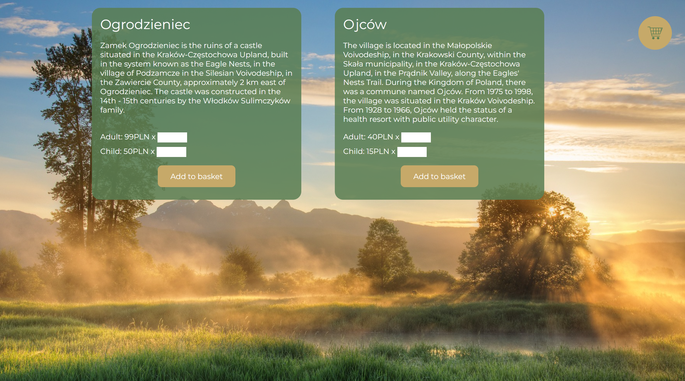

# JS Forms

It's the conclusion of **7th chapter** (there's **20**) of [devmentor.pl](https://devmentor.pl/mentoring-javascript) mentoring program.

## How to check it out:

1) fetch the project.
2) clone it on your pc.
3) use [Live Server](https://marketplace.visualstudio.com/items?itemName=ritwickdey.LiveServer).
4) load example.csv from the root directory.

#### Check .js files:

./assets/js/script.js
./assets/js/styles.js

---

## :memo: Tasks:

1) Read and parse .csv file.
2) Create html structure for parsed data.
3) Display excursions.
4) Data Validation: number of tickets, name, email.
5) Display total order price.

### :man_technologist: User can:
1) load .csv file.
2) Add excursions to basket.
3) open/close basket.
4) Remove tickets.
5) Order tickets (popup is being showed - in this project data **IS NOT** pushed to the server)

---

## :mortar_board: Acquired skills:

:white_check_mark: Separation of Concerns (SOC): Implemented smaller functions to perform specific tasks, enhancing code maintainability and readability. 
:white_check_mark: File Handling: Used the 'FileReader' object for processing of file data. 
:white_check_mark: Regular Expressions: Employed regular expressions (Regex) for data validation. 
:white_check_mark: CSV Parsing: Found pattern to divide parts of data from the .csv file. 
:white_check_mark: Custom Events: Utilized custom events to automatically trigger the display of data after completion of .csv file reading. (I didn't know how to handle async operations back then.) 
:white_check_mark: HTML Structure Prototyping: Created HTML prototypes to simplify development in JS. 